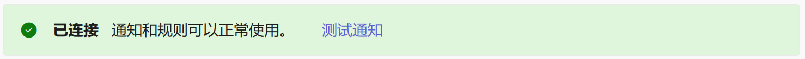

# Installation

First, make sure your computer meets the [Prerequisites](index.md#prerequisites).

Then, according to the [ClassIsland Docs](https://docs.classisland.tech/app/plugin.html), <mark>install the "RandPicker" plugin</mark> in the plugin marketplace.

:::info COMING SOON
Since the plugin development is not yet fully completed and the plugin marketplace review takes time, the "RandPicker" plugin cannot be found in the marketplace yet.
:::

Once RandPicker establishes a connection with ClassIsland, you can see this message in RandPicker Settings -> Notification & Integration -> ClassIsland:

At this point, you have completed the installation for ClassIsland integration.
