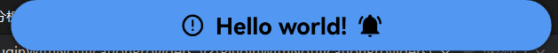
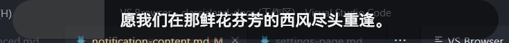
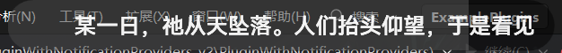
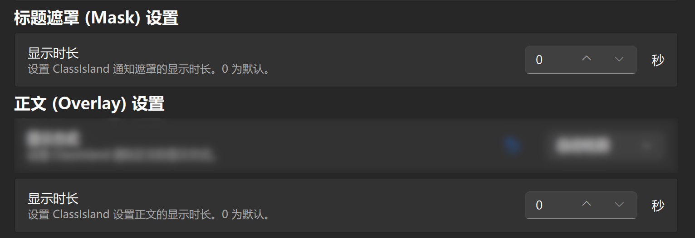
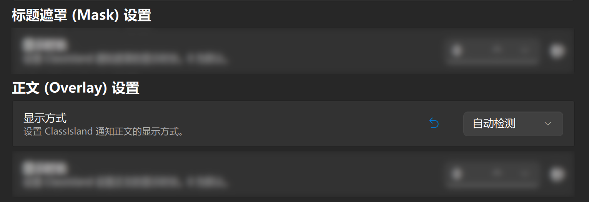

# 配置

除通知格式外，RandPicker 针对 ClassIsland 通知提供了一系列自定义选项。

## 了解一个通知

一般来说，一个提醒分为两部分：**<mark>遮罩 (Mask, 是标题)</mark> 和<mark>正文 (Overlay)</mark>**。

|部分|示例|
|-|-|
|标题遮罩||
|正文| |

你可以在 RandPicker 中配置它们的<mark>显示时长</mark>和<mark>显示方式</mark>。

## 设置显示时长

你可以在 RandPicker 设置 -> 通知 & 集成 -> ClassIsland 处，找到下面两个设置项：

你可以设置标题和正文的显示时长，**<mark>以秒为单位</mark>**。时长设为 0 时会使用默认值。

## 设置显示方式

你可以在 RandPicker 设置 -> 通知 & 集成 -> ClassIsland 处，找到下面这个设置项：

你可以设置正文的显示方式，有三个选项：

|选项|效果|
|-|-|
|简单||
|滚动||
|自动检测|即将到来。|

这项设置默认是“简单”。你可以通过蓝色的“撤销”键，恢复默认值。