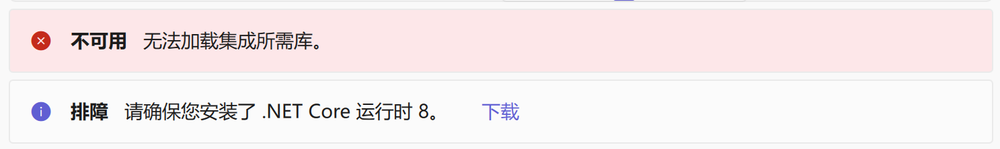

# ClassIsland

:::warning 不稳定
ClassIsland 集成服务仍处于开发阶段。
:::

:::warning 兼容性警告
集成只适用于 ClassIsland v2 (1.7.101.0 以上)[^1]。可能会增加对 ClassIsland v1 的兼容。
:::

RandPicker 使用 <mark>ClassIsland 插件</mark>[^1]与其通信。完成设置后，你可以让 RandPicker 将抽选通知发送到 ClassIsland，来获得更好的通知体验。

观看演示视频

## 先决条件

要安装 ClassIsland 集成，你需要：
- 安装了 1.7.101.0 以上版本的 <mark>ClassIsland</mark> [点此下载](https://www.classisland.tech/download)；
- 安装了适用于你的电脑的 <mark>.NET 8 运行时</mark> [点此下载](https://dotnet.microsoft.com/zh-cn/download/dotnet/8.0)。

:::tip 不知道你的电脑系统/架构？RandPicker 来帮你！
在 RandPicker 设置 -> 通知 & 集成 -> ClassIsland 中，若你没有安装 .NET 运行时，你会看到两条消息：

RandPicker 已为你的电脑获取适合的 .NET 下载链接。通常情况下，<mark>你只需要点击“下载”即可</mark>。
:::

## 安装

## 配置

[^1]: 见 [ClassIsland 文档](https://docs.classisland.tech/app/plugin.html)
